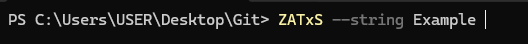
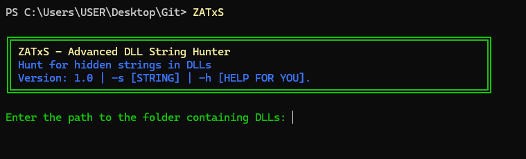
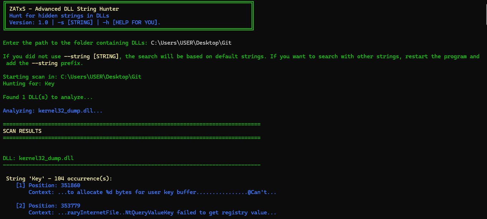
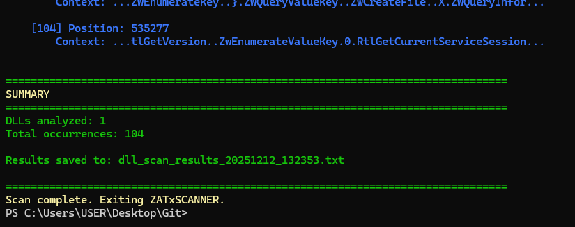

# ZATxS – Advanced DLL String Hunter

ZATxS is a fast and lightweight command-line tool designed to search for specific strings inside Windows DLL and executable files. It is especially useful for reverse engineering, ECU tuning research, seed-key algorithm hunting, and general binary string extraction tasks.

## Demonstrations

### Running with `--string`


### Interactive mode


### Scan results


### Summary and saved report


## Features
- High-performance binary string scanning with context preview
- Case-insensitive search with automatic regular-expression escaping
- Recursive or single-folder scanning
- Custom target strings via command-line arguments
- Colored terminal output with clean, readable formatting
- Automatic detailed report generation (timestamped TXT)
- Cross-platform (Windows)
- Zero external dependencies

## Installation
ZATxS includes an optional script named `Adicionar_PATH.py`, which automatically adds the generated ZATxS executable to the Windows PATH.

### Adding ZATxS to PATH automatically (Windows)
After generating the executable with tools like PyInstaller, run:
```
python Adicionar_PATH.py
```
This script will add the directory of the ZATxS executable to the Windows PATH, allowing you to run `ZATxS` from any terminal without specifying a folder.

### Manual installation
No compilation or external packages are required.

```
git clone https://github.com/DevDanielZanata/ZATxS.git
cd ZATxS
```

(Optional) Add `ZATxS.exe` to a folder in your PATH manually if you do not wish to use `Adicionar_PATH.py`.

## Usage
```
ZATxS [directory] [options]
```

### Basic examples
```
# Interactive mode
ZATxS

# Direct folder path
ZATxS "C:\\ECU\\DLLs"

# Drag-and-drop style
ZATxS "C:\\My Files\\DLLs"

# Custom strings (comma-separated)
ZATxS "C:\\DLLs" -s Seed,UnlockCode

# Custom strings + custom report name
ZATxS ./dll_folder -s MasterKey,CalculateKey -o report.txt
```

## Command-line options
| Option | Description |
|--------|-------------|
| directory | Path to folder containing DLL/EXE files (optional positional) |
| -s, --strings | Comma-separated list of strings to search for |
| -o, --output | Custom filename for the generated report |
| -h, --help | Show help message and exit |

If no `--strings` argument is provided, the tool uses the default values.

## Output
Real-time colored results are printed in the terminal, and a detailed text report is generated automatically, for example:
```
ZATxS_report_20251212_153045.txt
```
The report includes:
- Scan timestamp and target folder
- Searched strings
- DLL names, matched offsets, and context around each match
- Summary statistics

## Requirements
- Python 3.6 or higher
- Windows

No third-party packages required.

## License
ZATxS – We just do it, we simply do it.

